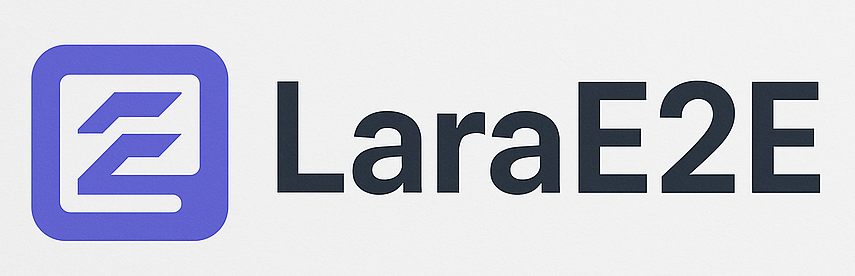

# LaraE2E

Este es un proyecto para administrar empresas.

Cada empresa tiene sus usuarios y roles, cada empresa tiene sus departamentos, cada empresa tiene sus empleados, cada empresa tiene su flujo de trabajo, cada empresa tiene sus conversaciones, etc.

Este es un proyecto desarrollado en Laravel 10 con Breeze + Vue pero que involucra:

archivos Excel, archivos PDF, Drag and Drop, DatatableJs, Gráficas, Modales o LightBox, Envío de correos electrónico, Notificaciones por email y base de datos, Chat, etc.

# Requerimientos

Estos son lo requerimientos básicos recomendados para este proyecto, que también
son compatibles con Laragon ([link](https://laragon.org)).

- PHP 8.1.x
- MySQL 8.0.39
- Apache 2.4.54
- NodeJs 18.20.x
  - npm 9.6.2
  - pnpm 10.7.0
- Composer version 2.4.1
- Laravel Installer 4.0.0
